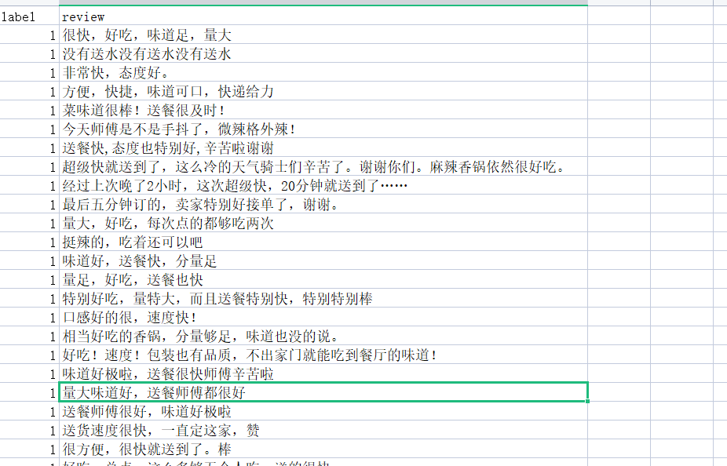

# 非结构化文本查重

## 功能说明

半结构化及非结构化文本的重复问题，将重复的非结构化文本检索出来：

半结构化及非结构化文本是以文本（如字符、数字、标点、各种可打印的符号等）作为数据形式的非结构化的数据；非结构化或半结构化数据的典型代表是图书馆数据库中的文档，这些文档可能包含结构字段，如标题、作者、出版日期、长度、分类等，也可能包含大量非结构化文本成分，如摘要和正文内容。应为非结构化文本的内容的随机性，不固定性，这类文本的去重一般比较复杂。

这个程序提供一种根据文本相似度匹配的方式，实现文本内容重复的抽取。

这里举个实际例子：

如图示数据集为某餐厅评论数据集，数据有两列，label表示评论是的正面的（1），或负面的（0）。review是评论的内容，这里评论的内容就可以看作非结构化文本。我们这个程序是可以把非结构化重复的检查出来。也就是评论内容比较相近的提取出来。




经过算法检索提取后，生成新的数据文件，如图示：

该算法程度自动将评论文本内容相近的样本拼接在一块，我将每一相似组用填充颜色标识了出来，并且新增了三列：clusterId(表示相似文本组的ID,自增的)、sim_score(表示每个组中相似成员与第一个成员匹配的相似度)、clusterId_count(是个统计，统计这一组有几个样本)。

如图可以很直观的看出算法查出非结构化文本重复值的效果。


代码开源在我的git上，相关使用说明如下。关于算法的抽取过程比较简单，主要算法设计在于匹配相似度的计算，如果大家可以先自行研究一下，如果大家评论留言要求说说代码更多细节，我可能会在写一篇博客。

这里先重点写些代码的使用方式：

## 文件说明

该工程文件包括以下四个文件：

- `config.yaml`: 配置文件，用于指定输入文件、输出文件、数据处理和数据聚类的参数。
- `run.py`: 主程序文件，用于读取配置文件并执行数据处理和数据聚类。
- `data_cluster.py`: 数据聚类的核心代码文件。
- `data_processor.py`: 数据处理的核心代码文件。

## 使用说明

1. 安装依赖项

在运行该工程文件之前，请确保您已经安装了以下依赖项：

- `pandas`: 用于数据处理。
- `numpy`: 用于数据聚类。
- `jieba`: 用于分词。

如果您还没有安装这些依赖项，请参照requirements.txt安装

1. 配置文件修改

在运行该工程文件之前，请确保您已经修改了`config.yaml`文件，以指定正确的输入文件、输出文件、数据处理和数据聚类的参数。具体参数说明如下：

### `data_processor`参数说明

- `input_file`: 指定输入文件的路径和文件名。
- `sheet_name`: 指定输入文件中需要读取的工作表名称。
- `output_file`: 指定处理后的数据保存的路径和文件名，如果不想输出文件，则将该参数注释掉。

### `data_cluster`参数说明

- `output_file`: 指定数据聚类后的输出文件保存的路径和文件名。
- `columns`: 指定需要以哪些字段进行相似性比较。
- `threshold`: 指定相似性阈值，表示将相似度超过该阈值的样本聚合在一块。在开启分词模式的情况下阈值建议0.5-0.8，不开分词的情况下阈值建议0.8以上。具体情况需要结合结果分析。
- `isjieba`: 指定是否开启分词模式，开启为True，否则为False。

1. 运行程序

在修改完`config.yaml`文件后，使用以下命令运行程序：

```
python run.py
```

程序会根据配置文件中的参数，读取输入文件并进行数据处理和数据聚类。处理后的数据会保存在指定的输出文件中。

1. 数据处理和数据聚类说明

数据处理和数据聚类的具体实现方法请参考`data_processor.py`和`data_cluster.py`文件。如果您想修改数据处理和数据聚类的方法，可以在这两个文件中进行修改。

## 注意事项

- 建议输入的数据不要过大，数据表格长度2K-6K，比较适宜，数据越大跑一边是时间越长（倍数增长）。
- 请务必修改`config.yaml`文件，以指定正确的输入文件、输出文件、数据处理和数据聚类的参数。
- 如果您想修改数据处理和数据聚类的方法，请在`data_processor.py`和`data_cluster.py`文件中进行修改。

DataProcessor是一个用于处理Excel文件的类，它可以读取Excel文件并处理其中的数据，最终输出一个规范化后的DataFrame对象。


## 其他说明（关于代码细节，感兴趣可以看看）

### DataProcessor

使用DataProcessor需要在程序中引入pandas库和该类，例如：

```
import pandas as pd
from data_processor import DataProcessor
```

创建DataProcessor对象：

```
processor = DataProcessor(file_path, sheet_name=None)
```

其中，`file_path`是待处理的Excel文件路径，`sheet_name`是要读取的工作表的名称，默认为None，表示读取第一个工作表。

处理Excel文件：

```
df = processor.process()
```

`process()`方法将读取Excel文件，处理数据，并返回一个规范化后的DataFrame对象。

保存处理后的数据：

```
processor.save_processed_data(file_path)
```

`save_processed_data()`方法将处理后的数据保存为Excel文件，`file_path`是保存文件的路径及文件名。

注意，如果要保存处理后的数据，必须在执行`process()`方法后才能调用`save_processed_data()`方法。

例如，完整的代码示例如下：

```
import pandas as pd
from data_processor import DataProcessor

# 创建DataProcessor对象
processor = DataProcessor('input_file.xlsx', sheet_name='Sheet1')

# 处理Excel文件
df = processor.process()

# 保存处理后的数据
processor.save_processed_data('output_file.xlsx')
```

其中，'input_file.xlsx'是待处理的Excel文件路径，'Sheet1'是要读取的工作表名称，'output_file.xlsx'是处理后的数据要保存的文件路径及文件名。

### DataCluster

这是一个用于文本聚类的Python类，使用了Jaccard相似度计算文本的相似度，并通过阈值将相似的文本聚成一类。

该类有三个方法：

- SimSeq2set：计算两个文本的Jaccard相似度。
- scan_list：将一个文本列表聚成若干类，并将聚类结果以DataFrame的形式输出。
- progress_bar：显示聚类进度的进度条。

该类使用了Python中常见的数据科学库，如pandas、numpy和jieba（用于中文分词）等。该类的实现并不完美，可能存在一些问题，需要使用者自己根据需求进行改进。