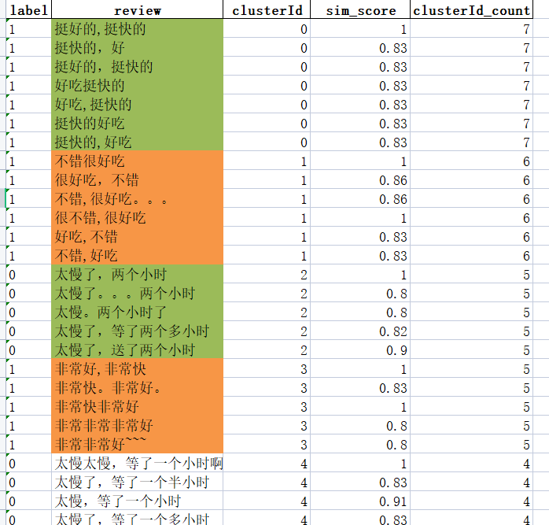

# Text-lookup-duplicate-value
## Preface

Repetitive issues of semi-structured and unstructured texts, retrieve repeated unstructured texts:

Semi-structured and unstructured text is unstructured data in the form of text (such as characters, numbers, punctuation, various printable symbols, etc.); the typical representative of unstructured or semi-structured data is the book Documents in library databases, these documents may contain structural fields, such as title, author, publication date, length, classification, etc., and may also contain a large number of unstructured text components, such as abstract and body content. Due to the randomness and infixity of the content of unstructured text, the deduplication of such text is generally more complicated.

This program provides a method of matching based on text similarity to achieve repeated extraction of text content.

Here is a practical example:

As shown in the figure, the data set is a restaurant review data set. The data has two columns, and the label indicates whether the review is positive (1) or negative (0). review is the content of the review, where the content of the review can be regarded as unstructured text. Our program can check out unstructured duplication. That is, the comments with similar content are extracted.


After algorithm retrieval and extraction, a new data file is generated, as shown in the figure:

The algorithm automatically stitches together samples with similar content in the comment text. I marked each similar group with a fill color, and added three new columns: clusterId (indicates the ID of the similar text group, which is self-increasing), sim_score (Indicates the similarity between similar members in each group and the first member), clusterId_count (is a statistic, counting how many samples there are in this group).

As shown in the figure, it can be seen intuitively that the algorithm detects the effect of repeated values in unstructured text.



The code is open source on my git, and the relevant instructions are as follows. The extraction process of the algorithm is relatively simple. The main algorithm design lies in the calculation of matching similarity. If you can study it yourself first, if you leave a comment and ask for more details about the code, I may write a blog.

Here we focus on how to use the code:

## File

The project file includes the following four files:

- `config.yaml`: configuration file, used to specify the parameters of input files, output files, data processing and data clustering.
- `run.py`: main program file to read configuration files and perform data processing and data clustering.
- `data_cluster.py`: The core code file for data clustering.
- `data_processor.py`: The core code file for data processing.

## Use

1. Install dependencies

Before running this project file, please make sure you have installed the following dependencies:

- `pandas`: for data processing.
- `numpy`: for data clustering.
- `jieba`: used for word segmentation.

If you have not installed these dependencies, please refer to requirements.txt to install

1. Configuration file modification

Before running the project file, please make sure you have modified the `config.yaml` file to specify the correct input file, output file, data processing and data clustering parameters. The specific parameters are described as follows:

### `data_processor` parameter description

- `input_file`: Specifies the path and filename of the input file.
- `sheet_name`: Specify the name of the worksheet in the input file that needs to be read.
- `output_file`: Specifies the path and file name for saving the processed data. If you do not want to output the file, comment out this parameter.

### `data_cluster` parameter description

- `output_file`: Specify the path and file name to save the output file after data clustering.
- `columns`: Specify which fields need to be used for similarity comparison.
- `threshold`: Specifies the similarity threshold, which means that the samples whose similarity exceeds the threshold are aggregated together. When the word segmentation mode is turned on, the threshold value is recommended to be 0.5-0.8, and when the word segmentation mode is not turned on, the threshold value is recommended to be above 0.8. The specific situation needs to be analyzed in combination with the results.
- `isjieba`: Specifies whether to enable the word segmentation mode, which is True, otherwise it is False.

1. Run the program

After modifying the `config.yaml` file, run the program with the following command:

```
python run.py
```

The program will read the input file and perform data processing and data clustering according to the parameters in the configuration file. The processed data will be saved in the specified output file.

1. Description of data processing and data clustering

For the specific implementation methods of data processing and data clustering, please refer to `data_processor.py` and `data_cluster.py` files. If you want to modify the methods of data processing and data clustering, you can do so in these two files.

## Notice

- It is recommended that the input data should not be too large. The length of the data table is 2K-6K, which is more appropriate. The larger the data, the longer the running time (multiple growth).
- Be sure to modify the `config.yaml` file to specify the correct parameters for input files, output files, data processing, and data clustering.
- If you want to modify the method of data processing and data clustering, please modify it in `data_processor.py` and `data_cluster.py` files.

DataProcessor is a class for processing Excel files. It can read Excel files and process the data in them, and finally output a normalized DataFrame object.

### Other instructions (about the code details, you can take a look if you are interested)

### DataProcessor

Using DataProcessor requires introducing the pandas library and this class in the program, for example:

```
import pandas as pd
from data_processor import DataProcessor
```

Create a DataProcessor object:

```
processor = DataProcessor(file_path, sheet_name=None)
```

Among them, `file_path` is the path of the Excel file to be processed, and `sheet_name` is the name of the worksheet to be read. The default is None, which means to read the first worksheet.

Processing Excel files:

```
df = processor.process()
```

The `process()` method will read the Excel file, process the data, and return a normalized DataFrame object.

Save the processed data:

```
processor. save_processed_data(file_path)
```

The `save_processed_data()` method saves the processed data as an Excel file, and `file_path` is the path and file name of the saved file.

Note that if you want to save the processed data, you must execute the `process()` method before calling the `save_processed_data()` method.

For example, a complete code sample is as follows:

```
import pandas as pd
from data_processor import DataProcessor

# create DataProcessor object
processor = DataProcessor('input_file.xlsx', sheet_name='Sheet1')

# Process Excel files
df = processor.process()

# save the processed data
processor.save_processed_data('output_file.xlsx')
```

Among them, 'input_file.xlsx' is the path of the Excel file to be processed, 'Sheet1' is the name of the worksheet to be read, and 'output_file.xlsx' is the file path and file name to save the processed data.

### DataCluster

This is a Python class for text clustering. It uses Jaccard similarity to calculate the similarity of texts, and clusters similar texts into one category by thresholding.

This class has three methods:

- SimSeq2set: Computes the Jaccard similarity of two texts.
- scan_list: cluster a text list into several categories, and output the clustering results in the form of DataFrame.
- progress_bar: A progress bar showing the clustering progress.

This class uses common data science libraries in Python, such as pandas, numpy, and jieba (for Chinese word segmentation), etc. The implementation of this class is not perfect, and there may be some problems, which need to be improved by users themselves according to their needs.